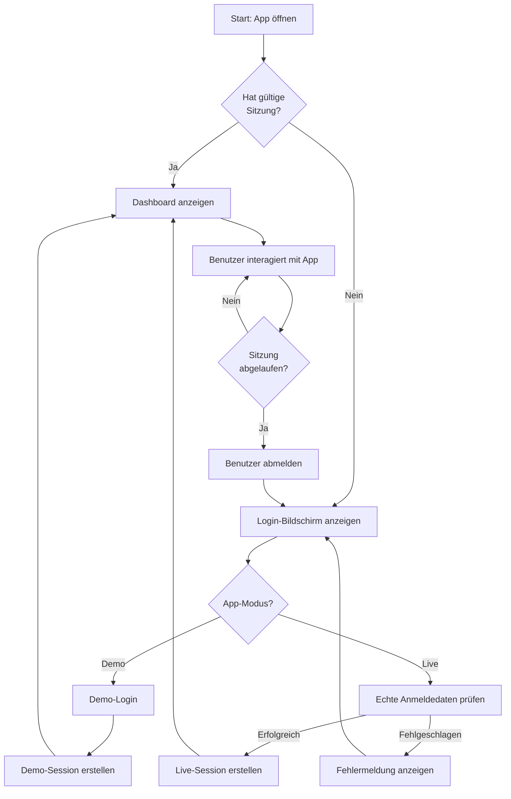
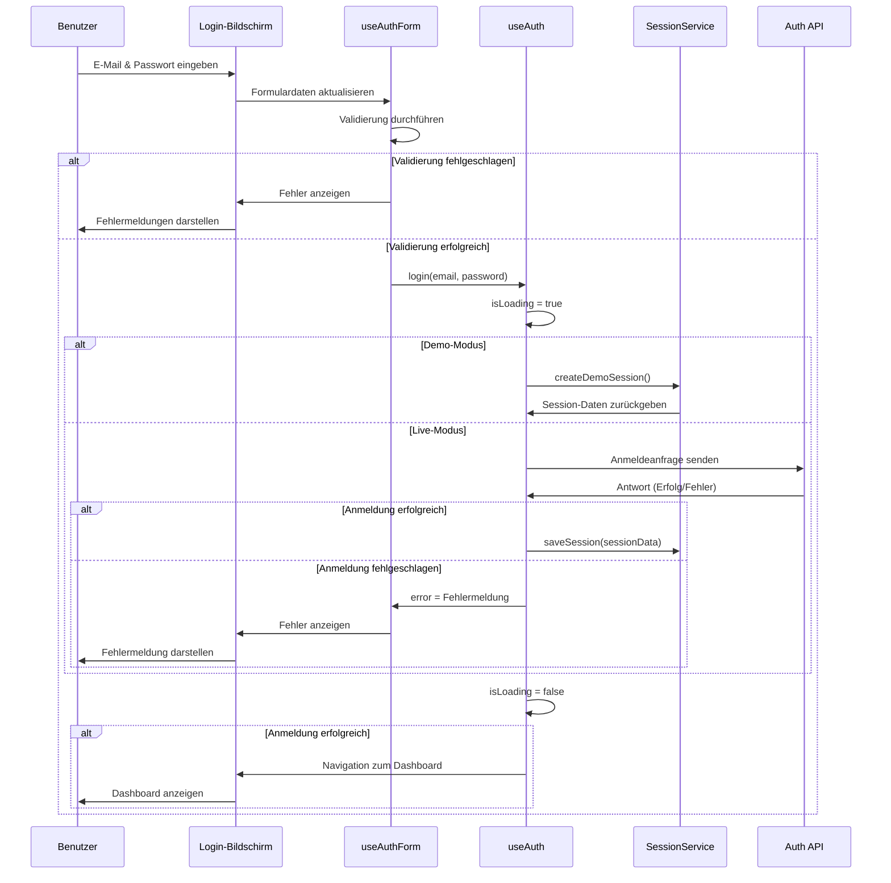
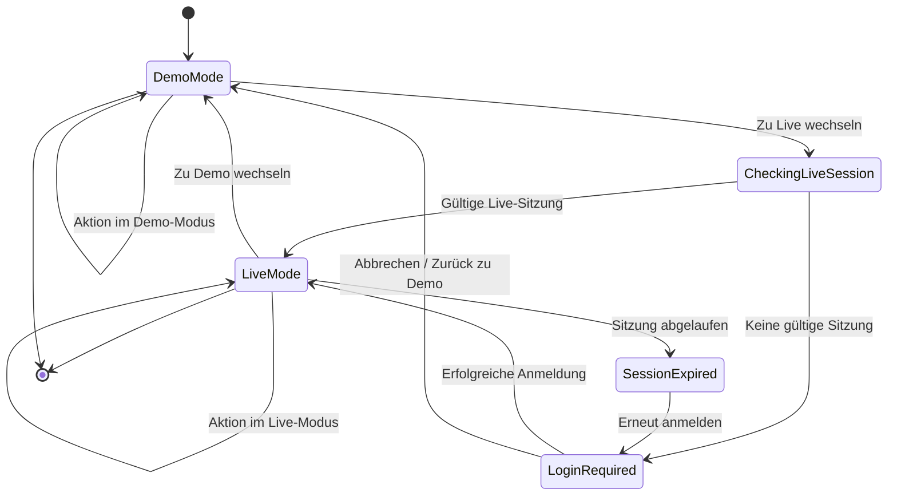
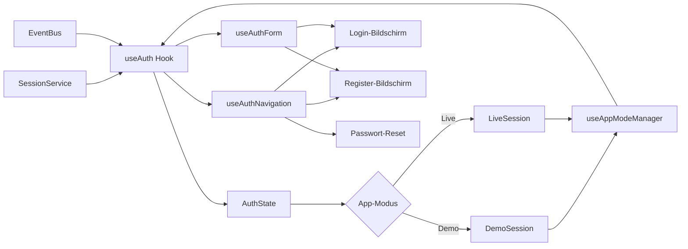
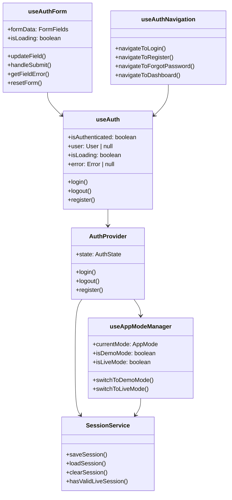
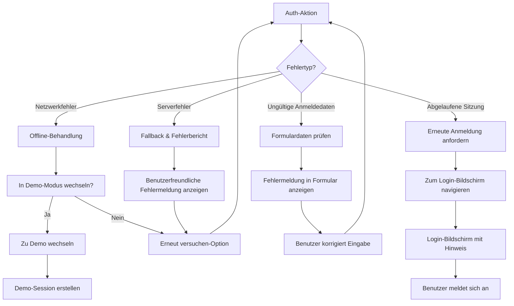

# Authentifizierungs-Flow Diagramm

Dieses Dokument enthält Flussdiagramme der wichtigsten Authentifizierungsprozesse in der Solvbox-App.

## Authentifizierungsfluss

## Login-Prozess

## App-Modus-Wechsel

## Auth-Hook Datenfluss

## Auth-Komponenten-Hierarchie

## Fehlerbehandlung

---

*Diagramme erstellt gemäß Gold Standard 5.2* 